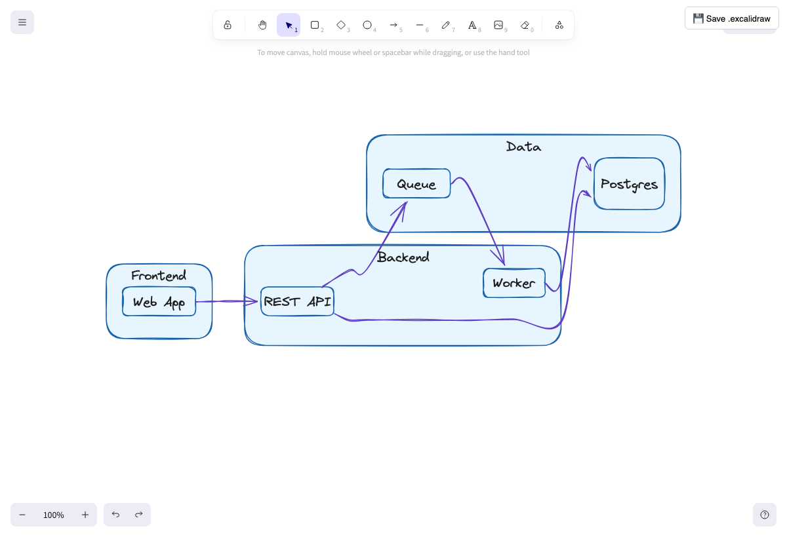

# excalidraw-diagrams

[](https://github.com/lojma/excalidraw-diagrams/actions/workflows/ci.yml)

A Claude Code skill that turns a described flow into a **live, editable
[Excalidraw](https://excalidraw.com) diagram** in your browser. You ask for a
diagram; Claude writes [Mermaid](https://mermaid.js.org/), and a real layout
engine (dagre) positions the nodes and routes the arrows — so diagrams come out
clean, with **no arrows crossing through blocks**.



## Why

Hand-placing diagram coordinates (the usual "have the model emit Excalidraw
JSON" approach) produces overlapping arrows and ugly layouts that need manual
fixing. This skill never does that — it delegates layout to a graph engine, then
renders the result as a genuine Excalidraw canvas you can drag, edit, and export.

- **Auto layout** — dagre routes around blocks; no arrows-over-blocks.
- **Live & editable** — opens a real Excalidraw canvas, not a static image.
- **No build, no deps** — React + Excalidraw load from a pinned CDN.
- **Self-reviewing** — screenshots the result so Claude catches layout issues before handing it to you.

## Requirements

- Node 22+
- Google Chrome / Chromium (for the render self-review). Set `CHROME_BIN` if it isn't auto-detected.

## Install

### Recommended: as a Claude Code plugin

This repo is a plugin marketplace. In Claude Code:

```
/plugin marketplace add lojma/excalidraw-diagrams
/plugin install excalidraw-diagrams@excalidraw-diagrams
```

Then just ask Claude to "draw" or "diagram" something. Update later with
`/plugin update excalidraw-diagrams`.

### Alternative: symlink (for local development)

Edit-in-place without reinstalling:

```bash
ln -sfn "$PWD/skills/excalidraw-diagrams" ~/.claude/skills/excalidraw-diagrams
```

Use one or the other, not both (they'd register the same skill twice).

## Usage

Ask Claude things like *"show me the auth flow"* or *"diagram this
architecture."* Under the hood it writes Mermaid and runs:

```bash
node skills/excalidraw-diagrams/render.mjs diagram.mmd --title "Auth flow" --style clean
# styles:      clean (default) | sketchy | colorful | mono
# --style-json '{"strokeColor":"#1862ab"}'   override any style field
# --serve                                     embedded/in-app browsers (prints an http://localhost URL)
```

The preview zooms to fit the whole diagram. Click **💾 Save .excalidraw**
(top-right) to download an editable file.

## Supported diagram types

| You want | Mermaid |
|----------|---------|
| flow / process / decisions | `flowchart` |
| actors exchanging messages | `sequenceDiagram` |
| classes / data model | `classDiagram` |
| architecture / system map | `flowchart` + `subgraph` |

Other Mermaid types degrade to a flat (non-editable) image, so the skill stays
within these.

## How it works

```
your request
  → Claude writes Mermaid
  → render.mjs injects it into a self-contained HTML page
  → @excalidraw/mermaid-to-excalidraw + dagre lay it out
  → Excalidraw renders an editable canvas
  → shot.mjs screenshots it for self-review
```

## Development

```bash
node --test test/*.test.mjs   # unit tests
node test/smoke.mjs           # end-to-end render smoke test (needs network + Chrome)
```

CI runs both on every push.

## License

MIT
